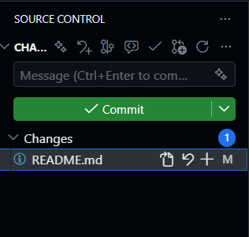
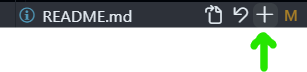
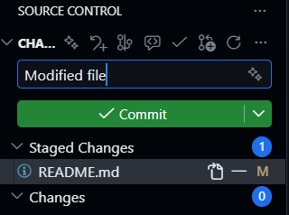
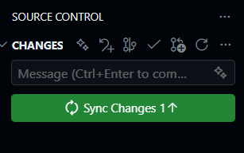
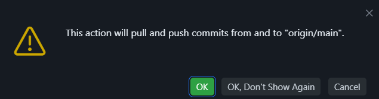
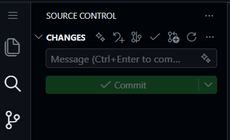

# intro-to-javascript
*An instructive repository for teaching the basics of JavaScript.*

### Code submission process

1. The editor will immediately recognize when you make a change to any file.  This will be evident to you because a little blue circle will appear in the vertical left navigation bar beside the source control icon (3rd one down).  The circle will contain the number of files you changed.  See below.

    

2. When you are ready to submit your assignment, meaning the changes you made to the homework file, click on that source control icon that has the blue circle on it.  This will open up the source control menu on the left side of the editor.  See below.

    

3. The file(s) that you changed will appear under the heading "Changes".  Click on the file and you'll see a little + sign to right of it.  If you mouse over the + sign it will say "Stage Changes"  Click on the plus sign to "stage" your file.  This is the first of three steps in submitting the file.  See below.

    

4. At this point the file that you are trying to submit is under a new category called Staged Changes.  You will need to add a short description of the changes you made (actually you literally can just type "Modified file" every time and it will work fine) and then click on the "Commit" button.  This is the second of three steps in submitting the file.  See below.

    

5. The file you were trying to submit has now disappeared from the menu and you will see that the title of the button has changed to read "Sync Changes".  Click on that button.  This is the third of three steps in submitting the file.  See below.

    

6. After clicking "Sync Changes" you may or may not see a confirmation popup that looks like the image below.  If you do, just click on "OK, Don't Show Again" and you shouldn't see the popup again.

    

7. At this point you should see no files in the Source Control
menu and no little blue circle by the source control icon.  See below.

    